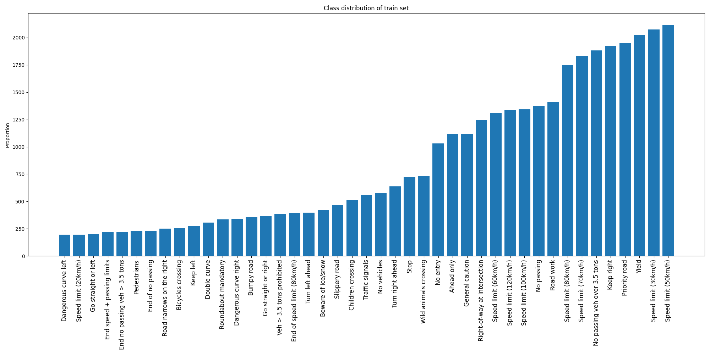

# Traffic Sign Classifcation Using VGG

## Model

*K. Simonyan and A. Zisserman, “Very deep convolutional networks for large-scale image recognition,” arXiv 1409.1556, 09 2014. https://arxiv.org/abs/1409.1556*

## Dataset

[GTSRB - German Traffic Sign Recognition Benchmark](https://www.kaggle.com/datasets/meowmeowmeowmeowmeow/gtsrb-german-traffic-sign)

| Split | Samples |
| ----------- | ----------- |
| Train | 36618 |
| Validation | 2591 |
| Test | 12630 |

*Validation set is randomly sampled with the seed specified in the config.yaml file from the training set.*

## Results

| Model                                         | Micro F1 (%) | Macro F1 (%) | Top-5 Accuracy (%) |
|-----------------------------------------------|--------------|--------------|--------------------|
| VGG19                                         | 97.45        | 95.09        | 98.64              |
| VGG16-D                                       | 97.92        | 95.92        | **99.76**          |
| VGG16-C                                       | 97.34        | 94.91        | 99.36              |
| VGG13                                         | 97.99        | 95.90        | 99.66              |
| VGG11                                         | 97.42        | 95.68        | 99.56              |
| VGG16-D with ENet1 class weighting | **98.19**    | **97.65**    | 99.62              |

*1Adam Paszke, Abhishek Chaurasia, Sangpil Kim, and Eugenio Culurciello. 2016. Enet: A deep neural network architecture for real-time semantic segmentation. arXiv preprint arXiv:1606.02147. https://arxiv.org/abs/1606.02147*

