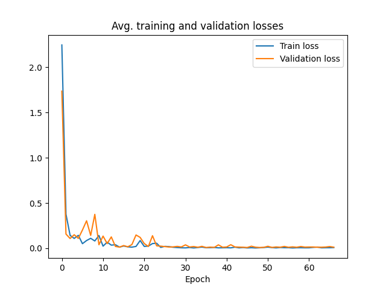
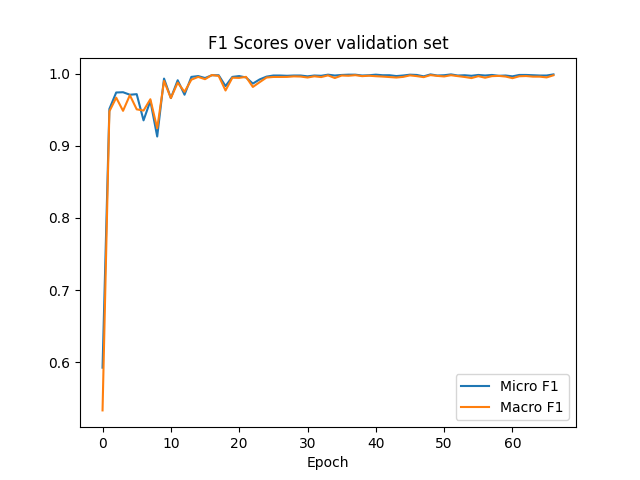
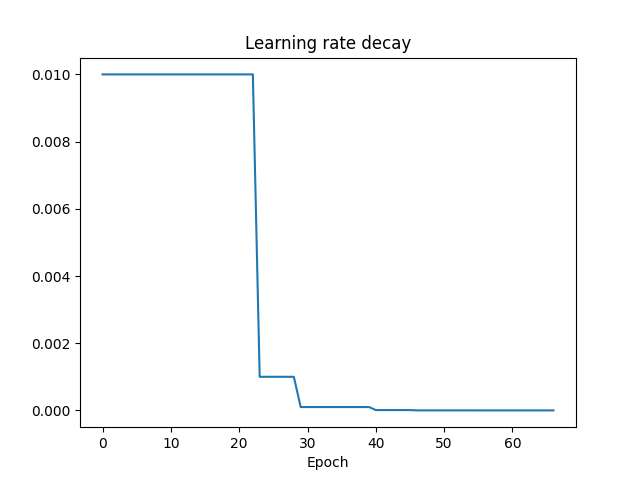
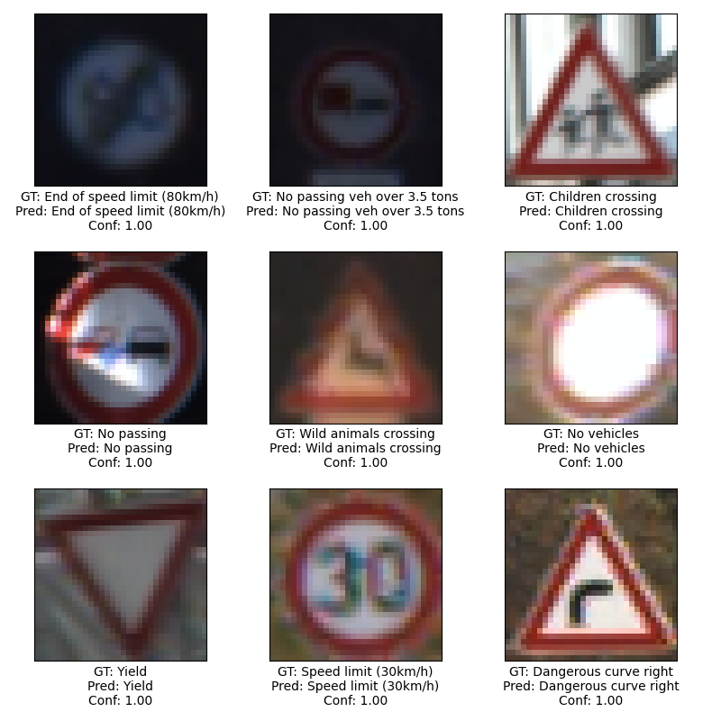

# Traffic Sign Classifcation Using VGG

## Model
We have used the VGG model architecture with different configurations<sup>1</sup>.


## Demo
To run the web app, first install dependencies
```
pip install -r requirements.txt
```
Then, run the following command
```
gunicorn wsgi:app
```
Open your browser and go to the specified URL in terminal

## Trainining & Testing
First, download the dataset from the URL in the Dataset section. Then, create a folder and put the dataset files/folders there. Then, go the `config.yaml` file and change the `DATA_ROOT` with the name of the folder you just created.
For training, run the following command
```
python3 train.py
```
Weights are saved in the directory: `models/<MODEL_NAME>/weights/`. For testing, first change the `WEIGHTS_NAME` to specify where to load the weights from, then run the following command
```
python3 test.py
```
which tests the model using the weights from `models/<MODEL_NAME>/weights/<WEIGHTS_NAME>`.
## Dataset

[GTSRB - German Traffic Sign Recognition Benchmark](https://www.kaggle.com/datasets/meowmeowmeowmeowmeow/gtsrb-german-traffic-sign)

| Split | Samples |
| ----------- | ----------- |
| Train | 36618 |
| Validation | 2591 |
| Test | 12630 |

*Validation set is randomly sampled with the seed specified in the config.yaml file from the training set.*

### Class Distribution
Classes are not evenly distributed as you can see the figure above. Thus, we also conducted experiments using ENet<sup>2</sup> class weighting in cross entropy loss function. In the figure below, you can see the weight plot as well.


## Preprocessing
We first crop the region-of-interest (ROI) given in the dataset .csv files. Then we resize the cropped image to a fixed size specified in the `config.yaml`. Then, we normalize and standardize the samples with the computed mean and std of the training set.


## Results
| Model                                         | Micro F1 (%) | Macro F1 (%) | Top-5 Accuracy (%) |
|-----------------------------------------------|--------------|--------------|--------------------|
| VGG19                                         | 97.45        | 95.09        | 98.64              |
| VGG16-D                                       | 97.92        | 95.92        | **99.76**          |
| VGG16-C                                       | 97.34        | 94.91        | 99.36              |
| VGG13                                         | 97.99        | 95.90        | 99.66              |
| VGG11                                         | 97.42        | 95.68        | 99.56              |
| VGG16-D with ENet<sup>2</sup> class weighting | **98.19**    | **97.65**    | 99.62              |

## Training Plots



## Confusion Matrix

## Randomly Selected Test Samples


## References
1. *K. Simonyan and A. Zisserman, “Very deep convolutional networks for large-scale image recognition,” arXiv 1409.1556, 09 2014. https://arxiv.org/abs/1409.1556*
2. *Adam Paszke, Abhishek Chaurasia, Sangpil Kim, and Eugenio Culurciello. 2016. Enet: A deep neural network architecture for real-time semantic segmentation. arXiv preprint arXiv:1606.02147. https://arxiv.org/abs/1606.02147*