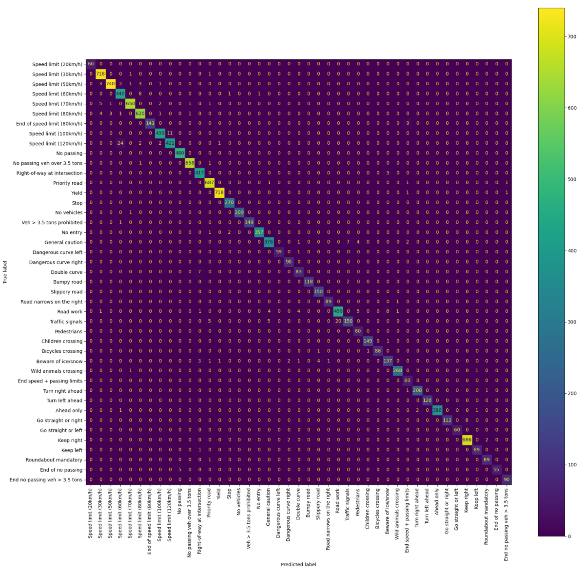

# Traffic Sign Classifcation Using VGG
## Model
*K. Simonyan and A. Zisserman, “Very deep convolutional networks for large-scale image recognition,” arXiv 1409.1556, 09 2014. https://arxiv.org/abs/1409.1556*
## Dataset
[GTSRB - German Traffic Sign Recognition Benchmark](https://www.kaggle.com/datasets/meowmeowmeowmeowmeow/gtsrb-german-traffic-sign)

| Split | Samples |
| ----------- | ----------- |
| Train | 36618 |
| Validation | 2591 |
| Test | 12630 |

*Validation set is randomly sampled with the seed specified in the config.yaml file from the training set.*

## Results
| Model | Micro F1 | Macro F1 | Top-5 Accuracy
| ----------- | ----------- | ----------- | ----------- |
| VGG-19 | 97.45% | 95.09% | 98.64% |

